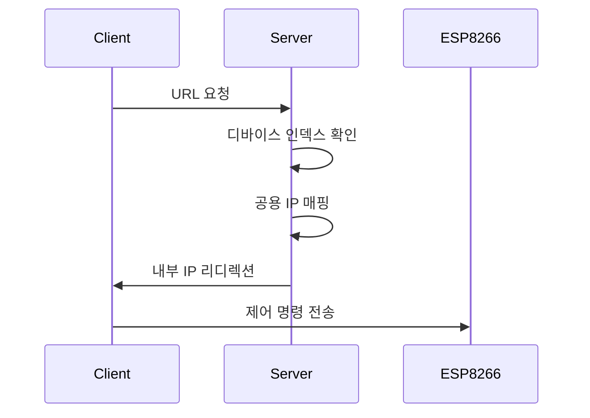

# 📱 WiFi 에어컨 컨트롤러

<div align="center">

[](https://www.arduino.cc/)

> 🌡️ ESP8266과 IR LED를 활용한 스마트 에어컨 원격 제어 시스템

</div>

---

## 📋 목차

-   [개요](#-개요)
-   [기능](#-기능)
-   [준비물](#-준비물)
-   [설치 방법](#-설치-방법)
-   [하드웨어 연결](#-하드웨어-연결)
-   [소프트웨어 구조](#️-소프트웨어-구조)
-   [문제 해결](#-문제-해결)

---

## 📖 개요

이 프로젝트는 ESP8266 마이크로컨트롤러를 사용하여 에어컨을 웹 브라우저를 통해 원격으로 제어할 수 있게 해주는 IoT 솔루션입니다.


## ✨ 기능

### 핵심 기능

-   🌐 웹 기반 원격 제어
-   📱 다중 디바이스 지원
-   🔄 실시간 상태 모니터링
-   🔒 안전한 내부 IP 매핑

### 기술적 특징

-   ESP8266 WiFi 모듈 활용
-   IR LED를 통한 에어컨 제어
-   Golang 기반 웹 서버
-   동적 IP 매핑 시스템

## 🔧 준비물

### 하드웨어

| 항목        | 수량 | 용도             |
| ----------- | ---- | ---------------- |
| ESP8266     | 1개  | 메인 컨트롤러    |
| IR LED      | 1개  | 적외선 신호 송신 |
| 점퍼 와이어 | 2개  | 연결용           |

### 소프트웨어

```yaml
필수 라이브러리:
    - ESP8266WiFi: WiFi 연결
    - IRsend: IR 신호 전송
    - ir_Samsung: 삼성 에어컨 프로토콜
    - IRremoteESP8266: IR 리모컨 기능
    - ESP8266WebServer: 웹 서버 기능
    - ESP8266HTTPClient: HTTP 클라이언트
```

## 🚀 설치 방법

### 1. 환경 설정

```bash
# 저장소 클론
git clone https://github.com/in-jun/wifi-ac-controller

# Arduino IDE 설치
# Windows/macOS: 공식 웹사이트에서 다운로드
# Linux:
sudo apt-get install arduino
```

### 2. WiFi 설정

```cpp
// Esp8266.ino
const char *ssid = "your-ssid";        // WiFi SSID
const char *password = "your-password"; // WiFi 비밀번호
const int deviceIndex = 0;             // 디바이스 인덱스
```

### 3. 업로드

1. Arduino IDE 실행
2. Tools → Board → ESP8266 선택
3. Port 선택
4. Upload 버튼 클릭

## 🔌 하드웨어 연결

### IR LED 연결도

```
ESP8266  |  IR LED
---------|----------
GPIO (D4)|  숏 핀(빨강)
GND      |  롱 핀(흰색)
```

### LED 상태 표시

| LED 상태    | 의미      |
| ----------- | --------- |
| 빠른 깜박임 | 초기화 중 |
| 켜짐        | 에러 발생 |
| 꺼짐        | 정상 작동 |

## 🖥️ 소프트웨어 구조

### 웹 서버 작동 방식



### API 엔드포인트

| 엔드포인트 | 기능      | 예시        |
| ---------- | --------- | ----------- |
| /on        | 전원 켜기 | `/0/on`     |
| /off       | 전원 끄기 | `/0/off`    |
| /status    | 상태 확인 | `/0/status` |

## 🔍 문제 해결

### 일반적인 문제

-   WiFi 연결 실패

    ```bash
    # 해결 방법
    1. WiFi 신호 강도 확인
    2. 비밀번호 재확인
    3. ESP8266 재부팅
    ```

-   IR 신호 미작동
    ```bash
    # 확인사항
    1. LED 연결 상태
    2. GPIO 핀 번호
    3. 에어컨과의 거리
    ```

---

<div align="center">

**[맨 위로 올라가기](#-wifi-에어컨-컨트롤러)**

Made with ❤️ by [in-jun](https://github.com/in-jun)

</div>
